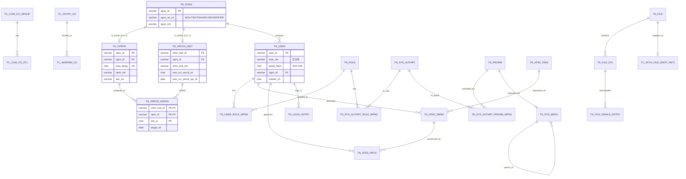
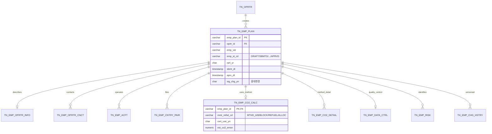
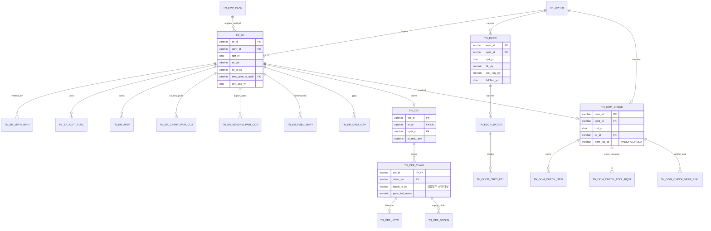
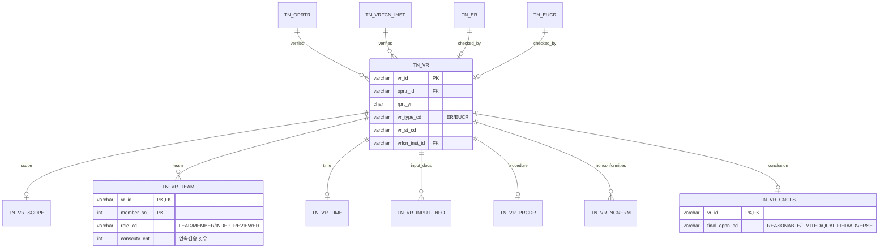
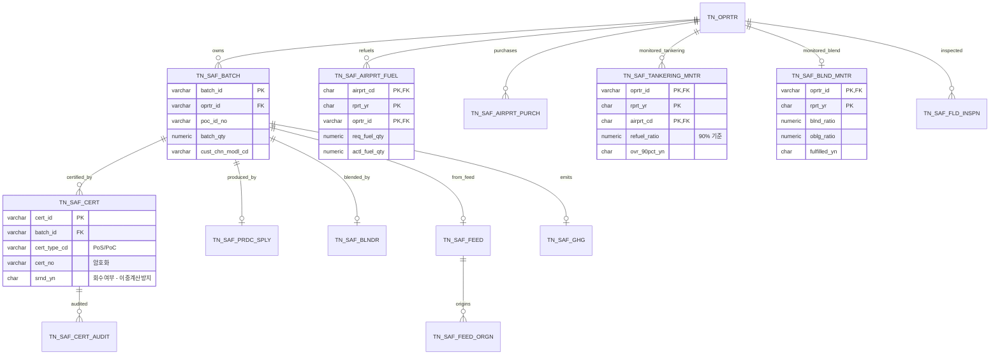
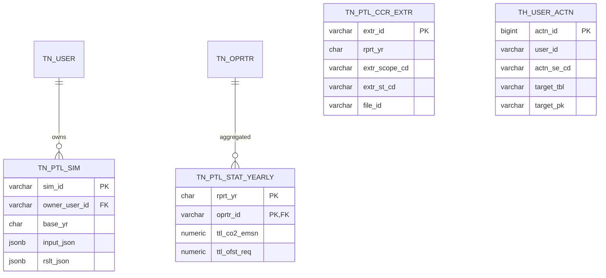
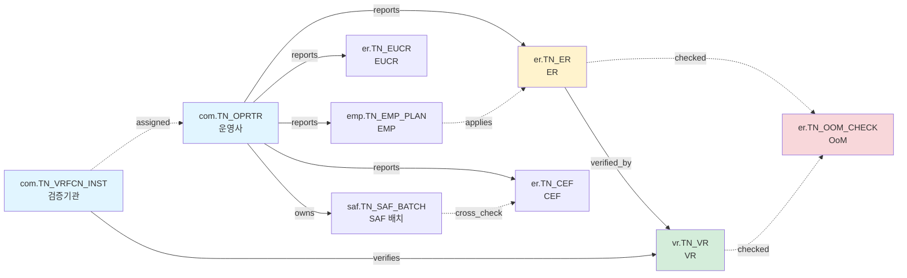

# icas-cems — ERD (Mermaid)

> **단일 소스**: 본 ERD 는 `db/initdb/오브젝트생성.sql` 의 논리적 시각화. 차이가 발견되면 SQL 이 정답.
> **스키마 6개**: com / emp / er / vr / saf / ptl

---

## 1. com — 공통

---

## 2. emp — 배출량 모니터링 계획서

---

## 3. er — 배출량 보고서 + CEF + EUCR + OoM

---

## 4. vr — 검증보고서

---

## 5. saf — 지속가능항공유

---

## 6. ptl — 포털/통계/시뮬레이션

---

## 7. 핵심 크로스 스키마 관계 요약

---

## 8. 테이블 수 통계

| 스키마 | 마스터 (TN_) | 코드 (TC_) | 이력 (TH_) | 합계 |
|--------|-------------|-----------|-----------|------|
| com | 14 | 5 | 2 | 21 |
| emp | 9 | 0 | 1 | 10 |
| er | 14 | 0 | 0 | 14 |
| vr | 8 | 0 | 0 | 8 |
| saf | 11 | 0 | 0 | 11 |
| ptl | 3 | 0 | 1 | 4 |
| **합계** | **59** | **5** | **4** | **68** |

> 68개 테이블이 1차년도 범위. 2차년도 (AI/LLM/OCR) 영역 추가 시 별도 확장.
