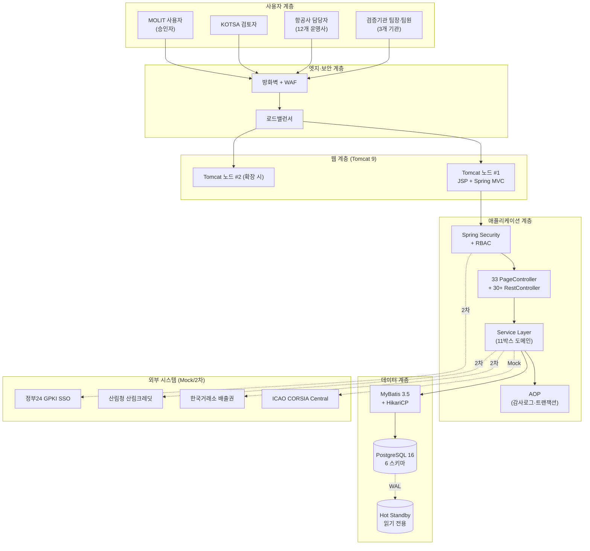
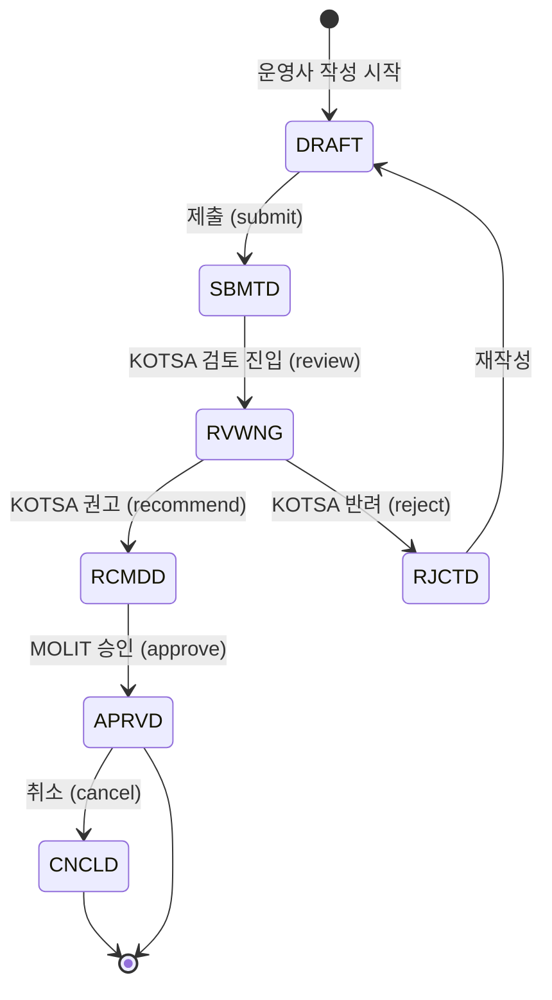
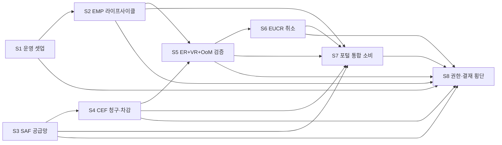
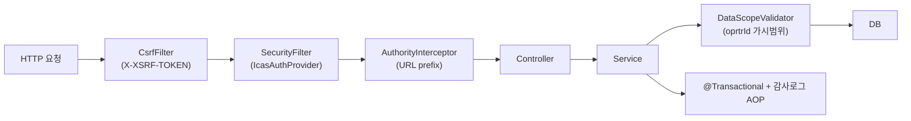

# 시스템 아키텍처 설계서

> **시스템**: ICAS-CEMS | **작성일**: 2026-05-24 | **버전**: v1.0

## 1. 전체 시스템 구성도



## 2. 기술 스택

| 계층 | 기술 | 버전 | 라이선스 |
|---|---|---|---|
| **OS** | Linux (CentOS/Ubuntu) | 7+ / 20+ | Open |
| **JDK** | OpenJDK | 17 LTS | GPL+CE |
| **WAS** | Apache Tomcat | 9.0.x (Servlet 4.0) | Apache 2.0 |
| **DBMS** | PostgreSQL | 16.x | PostgreSQL License |
| **프레임워크** | 전자정부 표준프레임워크 | 4.x | Apache 2.0 |
| **DI 컨테이너** | Spring Framework | 5.3.x | Apache 2.0 |
| **MVC** | Spring Web MVC | 5.3.x | Apache 2.0 |
| **보안** | Spring Security | 5.8.x | Apache 2.0 |
| **ORM** | MyBatis | 3.5.x | Apache 2.0 |
| **DB Pool** | HikariCP | 5.x | Apache 2.0 |
| **View** | JSP 2.3 + JSTL 1.2 | — | Apache 2.0 |
| **UI** | Bootstrap | 5.3.0 | MIT |
| **JS** | jQuery | 3.6.0 | MIT |
| **Chart** | ECharts | 5.4.3 | Apache 2.0 |
| **Font** | Pretendard | 1.3.9 | OFL |
| **Icon** | Bootstrap Icons | 1.11.0 | MIT |
| **빌드** | Maven | 3.9.x | Apache 2.0 |
| **테스트** | JUnit 5 + 자체 bash E2E | — | EPL / MIT |

## 3. 패키지 구조

```
kr.go.molit.icas
├── common/                  # 공통 모듈
│   ├── PageController       # JSP 라우팅 (33 화면)
│   ├── HealthController     # /health + /api/admin/health
│   ├── security/            # Spring Security 통합
│   │   ├── IcasAuthenticationProvider
│   │   ├── IcasUser, IcasUserDetailsService
│   │   ├── IcasLogoutHandler
│   │   ├── DataScopeValidator    # 데이터 스코프 검증
│   │   └── SecurityConfig
│   ├── interceptor/
│   │   └── AuthorityInterceptor  # URL prefix 권한 검증
│   ├── exception/
│   │   ├── BusinessException
│   │   └── GlobalExceptionHandler
│   ├── dto/                 # ApiResponse, PageResponse
│   └── util/                # Sha256, IdGenerator, IcasEsc
│
├── emp/                     # ① EMP 도메인
│   ├── plan/                # EmpPlanController, Service, Mapper, VO
│   ├── acft/                # 항공기
│   ├── cnct/                # 운영자 연결
│   ├── info/                # 운영자 정보
│   ├── cntry/               # 국가쌍
│   ├── co2/                 # CO2 계산·상세
│   ├── data/                # 데이터 품질
│   ├── risk/                # 리스크
│   └── hstry/               # 변경 이력
│
├── er/                      # ② ER ③ CEF ⑤ EUCR ⑥ OoM ⑦ CORSIA
│   ├── rprt/                # ER 본 보고
│   ├── cef/                 # CEF (적격연료)
│   ├── eucr/                # EUCR (배출권 취소) + validate (이중사용)
│   └── oom/                 # OoM + qchk (Rule 18종)
│
├── vr/                      # ④ VR (검증보고서)
│   ├── VrController, Service, Mapper
│   ├── scope/team/time/input/prcdr/ncnfrm/cncls (7 자식)
│
├── saf/                     # ⑧ SAF (지속가능항공유)
│   ├── cert/                # 인증서
│   ├── batch/               # 배치 + 5 자식 (ghg/feed/blndr/prdc/sply)
│   ├── airprt/              # 공항 (fuel/purch)
│   └── mntr/                # 혼합비율 모니터링
│
├── ptl/                     # ⑨ 포털
│   ├── workflow/            # 통합 워크플로우
│   ├── stat/                # 통계
│   ├── sim/                 # 시뮬레이션
│   ├── ccr/                 # CCR 추출
│   └── actn/                # 감사로그
│
└── com/                     # ⑩ 공통관리
    ├── auth/                # 로그인·로그아웃
    ├── user/role/authrt/    # 사용자·역할·권한
    ├── ognz/oprtr/vrfcn/    # 기관·운영사·검증기관
    ├── menu/prgrm/cd/       # 메뉴·프로그램·코드
    ├── atrz/                # 결재
    └── rglt/ntc/file/       # 규정·공지·파일
```

## 4. DB 스키마 구조 (6 스키마)

| 스키마 | 용도 | 주요 테이블 수 |
|---|---|---|
| `com` | 공통 (사용자·기관·권한·결재·코드) | 20+ |
| `emp` | EMP (모니터링 계획) | 10 |
| `er` | ER + CEF + EUCR + OoM | 15+ |
| `vr` | VR (검증보고서) | 8 |
| `saf` | SAF (인증서·배치·공항·혼합) | 10 |
| `ptl` | 포털 (시뮬·CCR·감사로그) | 4 |
| **합계** | | **약 67개** |

명명 규칙:
- `tn_` : 트랜잭션 (수정 가능)
- `tc_` : 코드성 (마스터)
- `th_` : 이력
- `tn_emp_plan` → 도메인 + 엔티티 (snake_case)

## 5. URL 라우팅 구조

```
/                            메인 대시보드
/main, /manual               메인·매뉴얼
/login                       로그인 (Spring Security)

/emp/plan, /emp/plan/{id}    ① EMP
/er/list, /er/{id}           ② ER
/er/cef, /er/cef/{id}        ③ CEF
/vr/list, /vr/{id}           ④ VR
/er/eucr, /er/eucr/{id}      ⑤ EUCR
/er/oom, /er/oom/{id}        ⑥ OoM
/er/oom/qchk                 ⑦ CORSIA 18종
/saf/dashboard|cert|batch|airprt|mntr  ⑧ SAF (5 화면)
/ptl/workflow|stat|sim|ccr|calendar|actn  ⑨ 포털 (6 화면)
/ai/console                  ⑩ AI (2차)
/com/user|ognz|oprtr|vrfcn|role|authrt|cd|menu|prgrm|atrz|rglt
                             공통관리 (11 화면)
/com/user/me/password        비밀번호 변경
/admin/health|icao-submit    운영자 (시스템 상태 + ICAO Mock)
/com/eco-fleet               친환경 항공기 도입 트래커

/api/com/auth/*              인증·로그아웃
/api/com/*, /api/emp/*, /api/er/*, /api/vr/*, /api/saf/*, /api/ptl/*
                             REST API
/health                      서비스 헬스체크
```

## 6. 비즈니스 라이프사이클 (공통 5단계)



적용 도메인: EMP / ER / VR / CEF / EUCR / OoM (6 도메인 통일 라이프사이클)

## 7. 데이터 흐름 (8 시나리오)



## 8. 보안 아키텍처



## 9. 배포 구성 (1차년도)

| 환경 | 구성 | 비고 |
|---|---|---|
| **개발** | macOS + Tomcat 9 + PostgreSQL 16 (로컬) | Hot Replace JSP |
| **운영 (권장)** | Linux 2대 (App) + 1대 (DB Master) + 1대 (DB Standby) | 운영 단계 |
| **백업** | 일 1회 pg_dump → /opt/icas/backup/ + S3 | 30일 보관 |

## 10. 확장성·향후 계획

| 시기 | 확장 |
|---|---|
| **1차년도** (`'26~'27) | EMP/ER/CEF/VR/EUCR/OoM/SAF/포털 11박스 + 12 운영사 |
| **2차년도** | AI 콘솔 4박스 (sLLM·OCR·범정부·XAI) + 외항사 200+ |
| **3차+** | KRX·산림청·GPKI 실 연계 + Docker/K8s 컨테이너화 |
