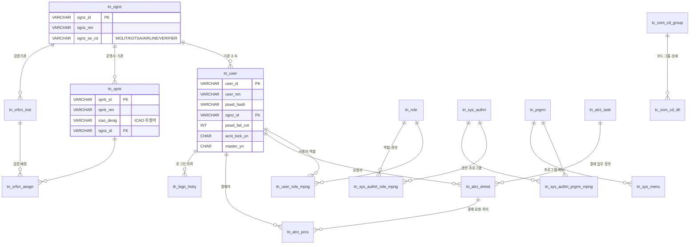
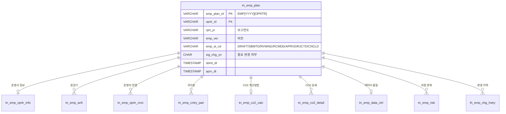
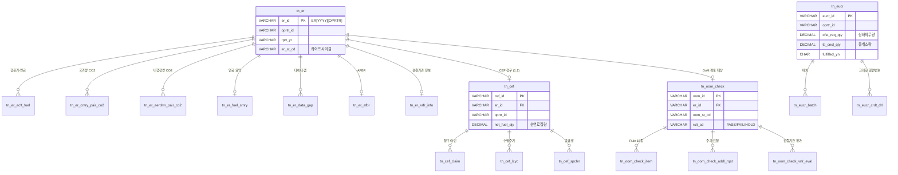
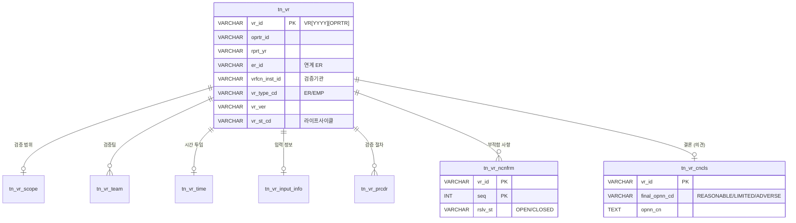
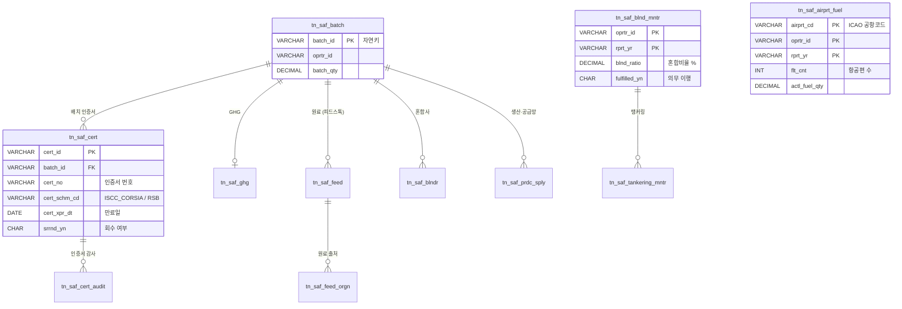
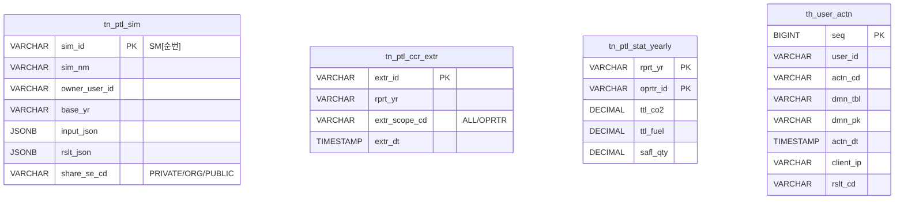

# DB ERD (Entity-Relationship Diagram)

> **DBMS**: PostgreSQL 16 | **스키마**: 6개 (com/emp/er/vr/saf/ptl) | **테이블**: 81개

## 1. 스키마 개요

| 스키마 | 테이블 수 | RFP 박스 |
|---|---|---|
| `com` | 27 | ⑩ 공통관리 (사용자·기관·권한·결재·코드·파일) |
| `emp` | 10 | ① EMP (모니터링 계획) |
| `er` | 19 | ② ER + ③ CEF + ⑤ EUCR + ⑥ OoM + ⑦ CORSIA |
| `vr` | 8 | ④ VR (검증보고서) |
| `saf` | 13 | ⑧ SAF (지속가능항공유) |
| `ptl` | 4 | ⑨ 포털 (시뮬·CCR·통계·감사로그) |

## 2. 명명 규칙

| 접두사 | 의미 | 예 |
|---|---|---|
| `tn_` | 트랜잭션 (수정 가능) | `tn_emp_plan`, `tn_er` |
| `tc_` | 코드성 (마스터·고정) | `tc_com_cd_group`, `tc_cntry_cd` |
| `th_` | 이력 (append only) | `th_emp_chg_hstry`, `th_user_actn` |

**컬럼 규칙**: snake_case + 도메인 접두사
- 공통 컬럼: `frst_reg_dt`, `frst_reg_user_id`, `last_chg_dt`, `last_chg_user_id`, `use_bgng_dt`, `use_end_dt`
- 소프트 삭제: `WHERE use_end_dt > NOW()`

---

## 3. com 스키마 ERD — 공통관리

### com 주요 테이블
| 테이블 | 용도 | 핵심 컬럼 |
|---|---|---|
| `tn_user` | 시스템 사용자 | user_id, pswd_hash, ognz_id, pswd_fail_cnt, acnt_lock_yn |
| `tn_ognz` | 기관 (MOLIT/KOTSA/AIRLINE/VERIFIER) | ognz_id, ognz_se_cd |
| `tn_oprtr` | 운영사 (항공사) | oprtr_id, icao_desig |
| `tn_vrfcn_inst` | 검증기관 (KVA·선급·인정원) | vrfcn_inst_id |
| `tn_vrfcn_assgn` | 검증기관 ↔ 운영사 배정 | vrfcn_inst_id + oprtr_id + rprt_yr |
| `tn_role`, `tn_sys_authrt`, `tn_prgrm` + 3개 매핑 | RBAC 3단계 (사용자→역할→권한→프로그램) | api_path_prefix |
| `tn_atrz_task/dmnd/prcs` | 결재 (업무 정의·요청·처리) | atrz_dmnd_id, atrz_st_cd |
| `tc_com_cd_group/dtl` | 공통코드 | grp_id, cd, cd_nm |

---

## 4. emp 스키마 ERD — ① EMP (모니터링 계획)

---

## 5. er 스키마 ERD — ② ER + ③ CEF + ⑤ EUCR + ⑥ OoM

---

## 6. vr 스키마 ERD — ④ VR (검증보고서)

---

## 7. saf 스키마 ERD — ⑧ SAF

---

## 8. ptl 스키마 ERD — ⑨ 포털

---

## 9. 공통 컬럼 패턴

모든 `tn_*` 테이블은 다음 8개 공통 컬럼을 포함:

| 컬럼 | 타입 | 용도 |
|---|---|---|
| `frst_reg_dt` | TIMESTAMP | 최초 등록 일시 |
| `frst_reg_user_id` | VARCHAR(20) | 최초 등록자 |
| `last_chg_dt` | TIMESTAMP | 마지막 변경 일시 |
| `last_chg_user_id` | VARCHAR(20) | 마지막 변경자 |
| `use_bgng_dt` | TIMESTAMP | 사용 시작 (생성 시) |
| `use_end_dt` | TIMESTAMP | 사용 종료 — 소프트 삭제 (`9999-12-31` if 활성) |

소프트 삭제 쿼리: `WHERE use_end_dt > NOW()`

## 10. 인덱스 전략

| 패턴 | 적용 테이블 |
|---|---|
| PK 자동 인덱스 | 전 테이블 |
| (oprtr_id, rprt_yr) 복합 | tn_emp_plan, tn_er, tn_cef, tn_eucr, tn_vr, tn_oom_check, tn_saf_blnd_mntr |
| use_end_dt 단일 | 전 `tn_*` (소프트 삭제 필터) |
| sim_id LIKE 'SM%' | tn_ptl_sim (regex 채번) |
| actn_dt DESC | th_user_actn (감사로그 조회) |

## 11. 산출 통계

- **전체 테이블**: 81개
- **컬럼 수**: 약 800개
- **외래키 관계**: 약 60개
- **공통 코드 그룹**: 14종 (CERT_REGIS_MTHD_CD, ER_ST_CD, DNSTY_SE_CD, ...)
