# 유즈케이스 다이어그램 + 명세서

> **시스템**: ICAS-CEMS | **버전**: v1.0 | **Actor 수**: 4 + 시스템

## 1. 액터 (Actor)

| Actor | 역할 | 시스템 ID 예 |
|---|---|---|
| **MOLIT 관리자** | 국토부 — 최종 승인·운영 관리 | admin01, molit_admin |
| **KOTSA 검토자** | 한국교통안전공단 — 검토·권고·OoM 18종 | kotsa01, kotsa_rvwr |
| **항공사 담당자** | 12 운영사 — EMP·ER·CEF·EUCR·SAF 작성 | kal_user, aar_user, jna_mgr |
| **검증기관 팀장·팀원** | 3 기관 — VR 검증보고서 작성 | vrf_lead, vrf_member |
| **(System)** | 자동 배치·외부 연계 | — |

---

## 2. 유즈케이스 다이어그램 (RFP 11박스 기준)

```mermaid
graph LR
    subgraph EMP["① EMP 박스"]
        UC01[UC-01 EMP 신규 작성]
        UC02[UC-02 EMP 새 버전 생성]
        UC03[UC-03 EMP 검토·권고]
        UC04[UC-04 EMP 승인]
    end
    subgraph ER["② ER 박스"]
        UC05[UC-05 ER 본 보고 작성]
        UC06[UC-06 ER 자식 입력]
        UC07[UC-07 ER 검토·권고·승인]
        UC08[UC-08 법정 서식 출력]
    end
    subgraph CEF["③ CEF 박스"]
        UC09[UC-09 CEF 청구 등록]
        UC10[UC-10 CEF 이중청구 검증]
        UC11[UC-11 CEF 승인 + ER 차감]
    end
    subgraph VR["④ VR 박스"]
        UC12[UC-12 VR 신규 작성]
        UC13[UC-13 VR 부적합 등록]
        UC14[UC-14 VR 결론·의견]
        UC15[UC-15 VR 권고·승인]
    end
    subgraph EUCR["⑤ EUCR 박스"]
        UC16[UC-16 일련번호 이중사용 검증]
        UC17[UC-17 EUCR 배치 등록]
        UC18[UC-18 EUCR 취소 확정]
    end
    subgraph OOM["⑥⑦ OoM + CORSIA 박스"]
        UC19[UC-19 OoM 신규 작성]
        UC20[UC-20 Rule 18종 자동 검증]
        UC21[UC-21 OoM 추가 요청·평가]
        UC22[UC-22 OoM finalize PASS/FAIL]
    end
    subgraph SAF["⑧ SAF 박스"]
        UC23[UC-23 SAF 인증서 등록·회수]
        UC24[UC-24 SAF 배치 + 5 자식]
        UC25[UC-25 공항별 급유·구매]
        UC26[UC-26 혼합비율 자동 산출]
        UC27[UC-27 의무 충족·미달 판정]
    end
    subgraph PTL["⑨ 포털 박스"]
        UC28[UC-28 통합 워크플로우 매트릭스]
        UC29[UC-29 통계·시뮬]
        UC30[UC-30 CCR 추출]
        UC31[UC-31 운영 일정 캘린더]
        UC32[UC-32 감사로그 조회]
    end

    AIR((항공사)) --> UC01 & UC02 & UC05 & UC06 & UC08 & UC09 & UC16 & UC17 & UC18 & UC23 & UC24 & UC25
    KOTSA((KOTSA)) --> UC03 & UC07 & UC11 & UC15 & UC19 & UC20 & UC21 & UC22 & UC26 & UC27
    MOLIT((MOLIT)) --> UC04 & UC07 & UC11 & UC15 & UC18 & UC22 & UC28 & UC29 & UC30 & UC31 & UC32
    VRF((검증기관)) --> UC12 & UC13 & UC14
```

---

## 3. 유즈케이스 명세서 (대표 8건 — 시나리오 기반)

### UC-01: EMP 신규 작성

| 항목 | 내용 |
|---|---|
| **ID** | UC-01 |
| **이름** | EMP (모니터링 계획) 신규 작성 |
| **Actor** | 항공사 담당자 (AIRLINE_MANAGER) |
| **개요** | 운영사가 보고연도의 모니터링 계획을 작성한다. |
| **사전조건** | 운영사 등록 완료, 보고연도 -1 의 EMP 승인 (재계획 시) |
| **사후조건** | tn_emp_plan 상태 DRAFT, 7 자식 도메인 입력 가능 |
| **기본흐름** | 1. 사이드바 > EMP 클릭 2. "신규 작성" 버튼 → 모달 3. 보고연도·운영사·시작일 입력 4. 저장 → POST /api/emp/plan 5. 상세 화면으로 이동, 7탭 입력 |
| **대안흐름** | 3-1. 이전 버전 있음 → "새 버전 생성" 선택 (POST /api/emp/plan/{id}/new-version) |
| **예외흐름** | 권한 없음 → 403, 동일 보고연도 중복 → 비즈 예외 |
| **트리거 API** | POST /api/emp/plan, POST /api/emp/plan/{id}/new-version |
| **화면** | /emp/plan (목록), /emp/plan/{id} (상세 7탭) |
| **DB** | INSERT tn_emp_plan |

### UC-05: ER 본 보고 작성

| 항목 | 내용 |
|---|---|
| **ID** | UC-05 |
| **Actor** | 항공사 담당자 |
| **개요** | 보고연도의 배출량 본 보고서를 작성한다. |
| **사전조건** | 해당 운영사의 EMP가 APRVD 상태 |
| **사후조건** | tn_er + 7 자식 입력 완료, DRAFT 상태 |
| **기본흐름** | 1. ER 목록 > 신규 등록 2. 운영사·보고연도 → POST /api/er/rprt 3. 8개 자식 탭 입력 (acft-fuel, cntry-pair, aerdrm-pair, fuel-smry, data-gap, afbr, vrfr-info) 4. 제출 |
| **트리거 API** | POST /api/er/rprt, POST /api/er/rprt/{id}/{child} |
| **DB** | INSERT tn_er + 7 자식 테이블 |

### UC-12: VR 신규 작성

| 항목 | 내용 |
|---|---|
| **ID** | UC-12 |
| **Actor** | 검증기관 팀장 (VERIFIER_LEAD) |
| **개요** | 운영사 ER에 대해 검증보고서 신규 작성 |
| **사전조건** | 검증배정(tn_vrfcn_assgn)에 본 기관 + 운영사 + 보고연도 |
| **기본흐름** | 1. VR 목록 > 신규 등록 (검증기관) 2. 검증대상 운영사·보고연도·검증유형·대상 ER ID → POST /api/vr 3. 7 자식 탭 입력 (범위/팀/시간/입력정보/절차/부적합/결론) 4. 제출 → KOTSA 권고 → MOLIT 승인 |
| **예외흐름** | 결론이 REASONABLE인데 미해결 부적합 존재 → SFR-027 차단 |
| **트리거 API** | POST /api/vr, POST /api/vr/{id}/submit |
| **DB** | tn_vr + tn_vr_scope/team/time/input_info/prcdr/ncnfrm/cncls |

### UC-16: EUCR 일련번호 이중사용 검증

| 항목 | 내용 |
|---|---|
| **ID** | UC-16 |
| **Actor** | 항공사 담당자 |
| **개요** | EUCR 등록 전 일련번호 충돌 사전 검증 (SFR-031) |
| **사전조건** | 적격 배출권 일련번호 확보 |
| **기본흐름** | 1. EUCR 상세 > "일련번호 이중사용 사전 검증" 패널 2. 줄단위 입력 (예: VCS-2024-001) 3. 검증 실행 → POST /api/er/eucr/validate-double-using 4. 충돌 없음 → 초록 패널 / 충돌 있음 → 빨강 + 충돌 행 표시 |
| **트리거 API** | POST /api/er/eucr/validate-double-using 요청: { crdtNos: [], excludeEucrId } |
| **DB** | SELECT tn_eucr_crdt_dtl WHERE crdt_no IN (...) AND eucr_id <> excludeEucrId |

### UC-20: CORSIA Rule 18종 자동 검증

| 항목 | 내용 |
|---|---|
| **ID** | UC-20 |
| **Actor** | KOTSA 검토자 |
| **개요** | OoM 적정성 검토 시 정량 18종 룰을 자동 실행 (SFR-034) |
| **사전조건** | OoM 신규 작성, 연계 ER 존재 |
| **기본흐름** | 1. OoM 상세 > "Rule 18종 실행" 버튼 2. POST /api/er/oom/{id}/run-quant 3. 18종(R001~R018) 자동 평가 → tn_oom_check_item INSERT 4. 결과 화면: PASS/WARN/FAIL 카운트 + 항목별 상세 |
| **Rule 예시** | R001 ICAO 지정어, R005 보고의무(1만톤), R013 CERT 편차, R014 데이터 갭 초과, R018 전년대비 이상치 |
| **트리거 API** | POST /api/er/oom/{id}/run-quant |
| **DB** | INSERT tn_oom_check_item (18행) |

### UC-26: SAF 혼합비율 자동 산출

| 항목 | 내용 |
|---|---|
| **ID** | UC-26 |
| **Actor** | KOTSA 검토자 |
| **개요** | 운영사별 SAF 혼합비율 자동 산출 + 의무 이행 판정 (SFR-054) |
| **사전조건** | 공항별 급유 실적(tn_saf_airprt_fuel) + SAF 구매(tn_saf_airprt_purch) 적재 |
| **기본흐름** | 1. SAF 혼합비율 모니터링 > "운영사별 산출" 또는 "전체 일괄" 2. POST /api/saf/mntr/blnd/calc 3. SAF 구매량 ÷ 총 급유량 × 100 = 혼합비율 % 4. 의무비율(1%) 이상 → 이행 / 미만 → 미이행 5. tn_saf_blnd_mntr UPSERT |
| **트리거 API** | POST /api/saf/mntr/blnd/calc { oprtrId, rprtYr } |

### UC-29: 상쇄비용 시뮬레이션

| 항목 | 내용 |
|---|---|
| **ID** | UC-29 |
| **Actor** | MOLIT 관리자 |
| **개요** | 탄소가격·SAF비율·연간성장률 시나리오 시뮬레이션 |
| **기본흐름** | 1. 상쇄비용 시뮬 화면 2. 시뮬레이션명·기준연도·예측 시작/종료·탄소가격·연간성장률·SAF비율 입력 3. POST /api/ptl/sim → 백엔드 계산 (calculateSimulation) 4. 결과: 연도별 상쇄비용 추이 (라인 차트) + 배출량 (막대 차트) |
| **트리거 API** | POST /api/ptl/sim, POST /api/ptl/sim/{id}/run |
| **DB** | INSERT/UPDATE tn_ptl_sim (input_json, rslt_json) |

### UC-32: 감사로그 조회

| 항목 | 내용 |
|---|---|
| **ID** | UC-32 |
| **Actor** | MOLIT 관리자 |
| **개요** | 사용자·도메인·기간·액션유형으로 감사로그 조회 |
| **기본흐름** | 1. 감사로그 화면 2. 기간·사용자ID·액션유형·도메인테이블·처리결과 필터 3. 조회 → GET /api/ptl/actn 4. 5W1H 로그 그리드 + 엑셀 다운로드 |
| **트리거 API** | GET /api/ptl/actn?startDt=&endDt=&userId=&actnCd=&dmnTbl= |
| **DB** | SELECT ptl.th_user_actn |

---

## 4. 유즈케이스 합계 통계

- **총 32 유즈케이스**
- Actor별: MOLIT 11, KOTSA 10, 항공사 13, 검증기관 3
- 박스별 분포: EMP 4 / ER 4 / CEF 3 / VR 4 / EUCR 3 / OoM 4 / SAF 5 / 포털 5
- 라이프사이클 통합 패턴: 6 박스 공통 (DRAFT→SBMTD→RVWNG→RCMDD→APRVD)
