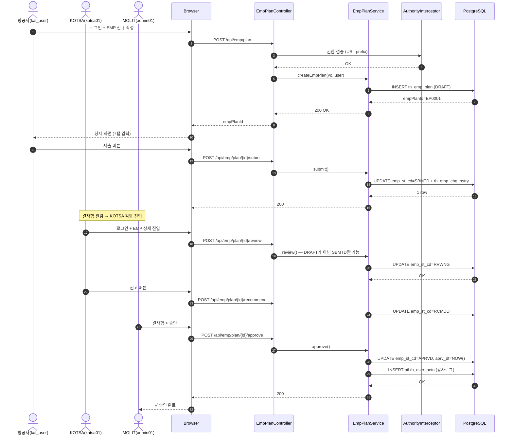
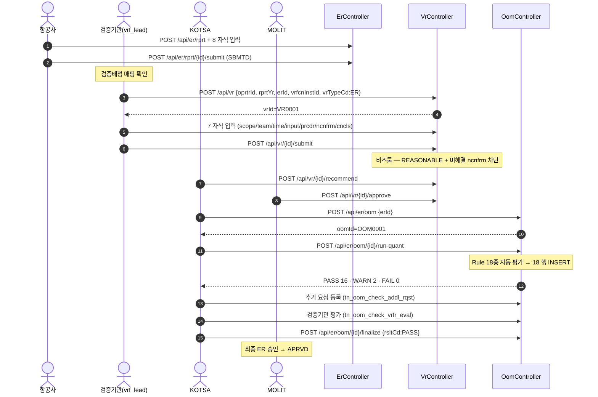
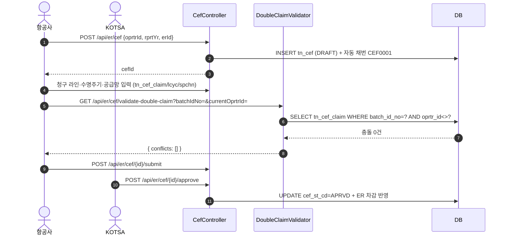
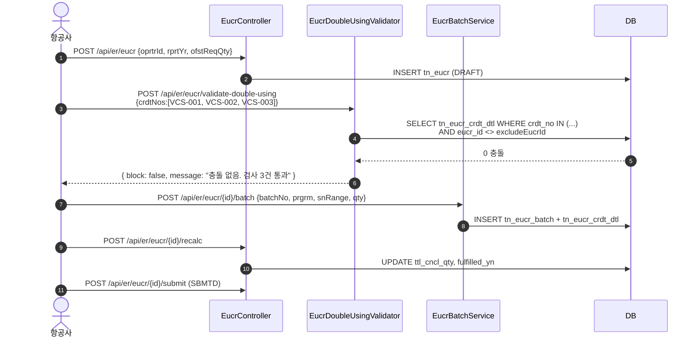
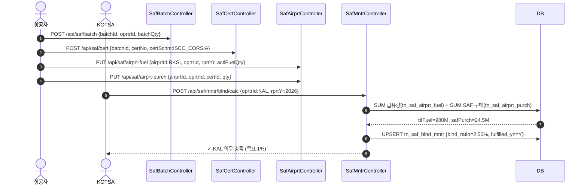
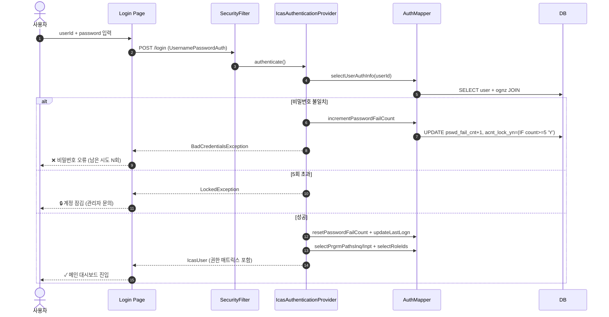
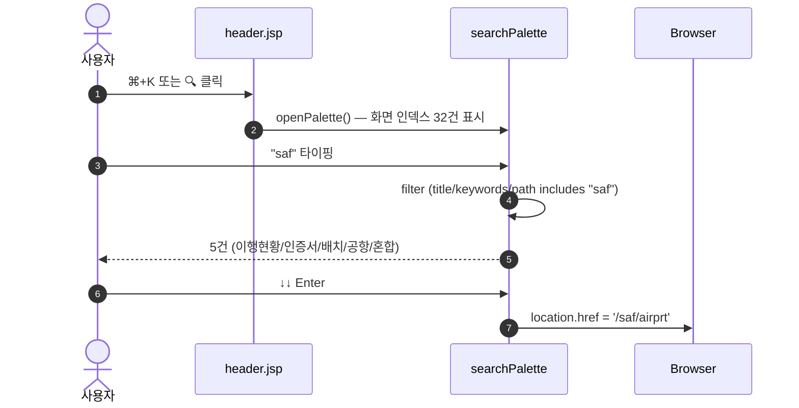
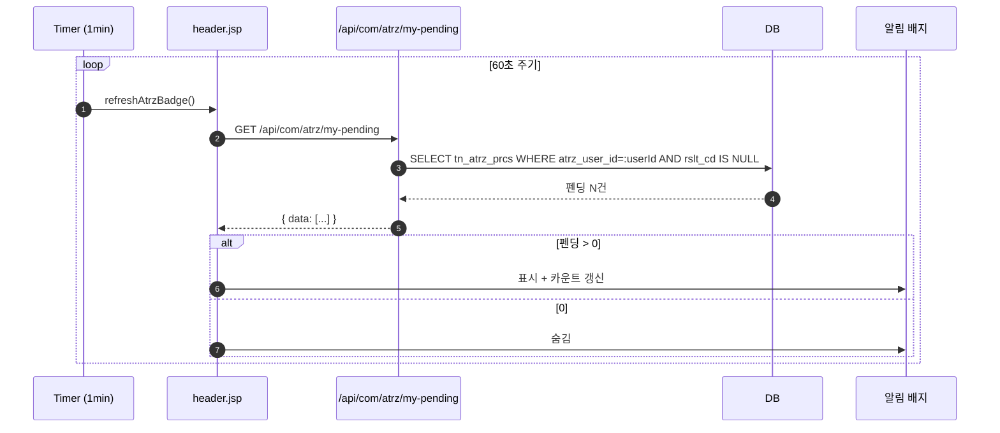

# 시퀀스 다이어그램 (Sequence Diagrams)

> **시스템**: ICAS-CEMS | **시나리오**: 8 핵심 (E2E S1~S8 매핑)

## SEQ-01: EMP 라이프사이클 — DRAFT → APRVD (3 actor 전환)

---

## SEQ-02: ER → VR → OoM 메인 검증 파이프라인

---

## SEQ-03: CEF 청구 + 이중청구 검증

---

## SEQ-04: EUCR 일련번호 이중사용 검증 + 배치 등록

---

## SEQ-05: SAF 공급망 → 혼합비율 산출

---

## SEQ-06: 로그인 + 5회 실패 자동 잠금

---

## SEQ-07: Cmd+K 전역 검색 팔레트

---

## SEQ-08: 헤더 알림 벨 — 결재 펜딩 자동 폴링

---

## 시퀀스 합계 통계

- **총 8 시퀀스 다이어그램**
- E2E 회귀 시나리오와 1:1 매핑 (S1~S8)
- 평균 행위자 수: 2~4 actor
- 평균 메시지 수: 8~12개
